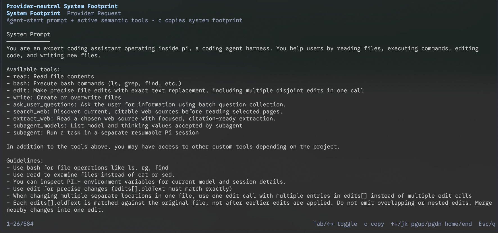
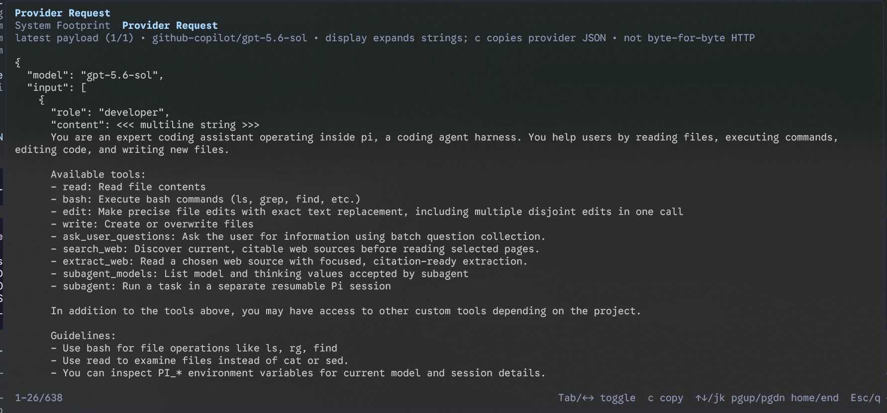

# Pi Request Footprint Viewer

Inspect the request footprint that Pi exposes to extensions. This [Pi](https://pi.dev) extension adds a `/system-context` command with exactly two views:

1. **Provider-neutral System Footprint** _(primary/default)_ — the persistent system-side context before conversation content: the assembled system prompt and active provider-neutral tool descriptors.
2. **Provider Request** _(secondary)_ — the latest complete payload observed by Pi's `before_provider_request` hook, after Pi's provider adapter has converted the request.

The viewer does not upload or log anything. All data stays in the local Pi process.





## Usage

After installing the package, restart Pi or run `/reload`, then run:

```text
/system-context
```

| Key             | Action                                         |
| --------------- | ---------------------------------------------- |
| `Tab` / `←` `→` | Toggle between the two views                   |
| `↑↓` / `j` `k`  | Scroll one line                                |
| `PgUp` / `PgDn` | Scroll one page                                |
| `Home` / `End`  | Jump to the top or bottom                      |
| `c`             | Copy the active view to the terminal clipboard |
| `Esc` / `q`     | Close the overlay                              |

The System Footprint is the initial tab. The Provider Request tab reports the provider/model when Pi exposes them and counts provider requests in the current low-level run. Only the latest provider payload is shown, so retries and repeated calls are not presented as one falsely definitive request.

## Semantics and fidelity boundary

### Provider-neutral System Footprint

This primary view contains only two semantic components, separated by presentation headings:

- **System Prompt** — the exact assembled string returned by `getSystemPrompt()`, rendered with its original real line breaks and paragraph structure; and
- **Tools** — active tools reduced to provider-visible semantics: `name`, `description`, `parameters`, and `constrainedSampling` only if the public runtime object genuinely exposes that field.

It never includes user, assistant, tool-result, session, or `context`-event messages. It does not show `sourceInfo` or separately append `promptGuidelines`; those are internal construction/provenance metadata, not independent tool descriptor fields. Guideline text that genuinely occurs inside the assembled system prompt remains there because removing it would make the exact prompt inaccurate. Parameter schemas remain structurally faithful.

Pressing `c` copies only these semantic system-footprint sections. It does not copy view labels, timestamps, run IDs, provider/model diagnostics, fidelity metadata, or unavailable-field lists. A short reconstruction caveat is UI chrome only and is not part of the copy.

The prompt and active tools are captured together at `agent_start`, after Pi's prompt assembly hooks have run. This gives the System Footprint a coherent prompt/tool snapshot for that agent run. Pi's public API does not expose a single atomic pre-adapter system-footprint object, so this view makes no claim about later provider-specific conversion.

### Provider Request

This secondary view captures the complete `event.payload` from `before_provider_request`. It is not filtered: provider-converted tools, full messages/conversation, provider-specific system fields, schemas, and other payload fields remain present. A structural renderer keeps object and array boundaries visible while rendering every multiline string as actual terminal lines instead of a wall of literal `\\n` escapes. It does not deduplicate, rewrite, or remove repeated values.

Pressing `c` copies the underlying pretty-printed JSON payload. That copy is faithful to the JavaScript payload's JSON representation, while the on-screen display expands multiline strings for readability; the footer states this distinction. This is **not a byte-for-byte HTTP capture**: the public hook does not expose final wire bytes, headers, transport encoding, compression, or provider SDK/network behavior. Later extension handlers may also replace the payload after this extension observes it.

## Install

Install from npm:

```bash
pi install npm:pi-system-prompt-viewer
```

Or install directly from GitHub:

```bash
pi install git:github.com/eggmasonvalue/pi-system-prompt-viewer
```

To try it for one session without adding it to your settings:

```bash
pi -e npm:pi-system-prompt-viewer
```

## Requirements

- Pi with extension support and the `before_provider_request` event
- Node.js supported by Pi
- An interactive Pi TUI session (the command is not available in print, JSON, or RPC mode)

## Development

Run the extension from a local checkout:

```bash
pi -e .
```

After making changes, run `/reload` in Pi. The extension intentionally has no runtime dependencies, network calls, or telemetry behavior. Shared code lives under `lib/`, outside Pi's auto-loaded `extensions/` directory.

The repository has a small dependency-free model test suite using Node's built-in test runner:

```bash
npm test
```

For a local typecheck, use the TypeScript compiler available in the Pi development environment:

```bash
tsc --noEmit --allowImportingTsExtensions --module nodenext --moduleResolution nodenext --target es2022 --skipLibCheck extensions/system-context.ts lib/footprint-model.ts tests/footprint-model.test.ts
```

The TUI itself should also be smoke-tested in an interactive Pi session: run one prompt, open `/system-context`, confirm the System Footprint opens first, toggle to Provider Request, scroll, and copy each view.

## License

Apache-2.0
